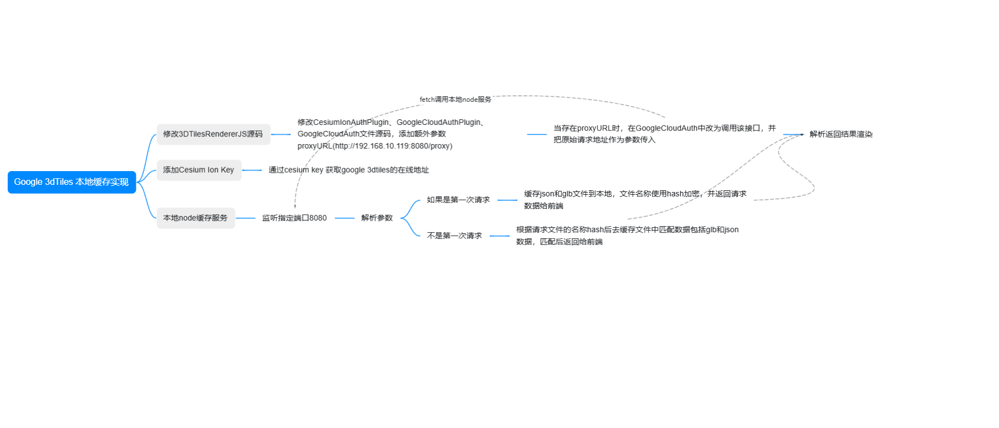

# 3d-tiles-renderer-0.4.18
 [https://github.com/NASA-AMMOS/3DTilesRendererJS](https://github.com/NASA-AMMOS/3DTilesRendererJS)

### 修改了3d-tiles-renderer部分源码，在node-google-tiles文件夹中添加了一个node服务，为了实现将google的3dtiles瓦片缓存到本地，首次使用需要添加一个环境变量文件.env，并添加环境变量 VITE_ION_KEY，值为cesium ion的key

### 然后运行example\bundle里面的googleMapsExample.html，并启动node服务，即可实现将google的3dtiles瓦片缓存到本地
